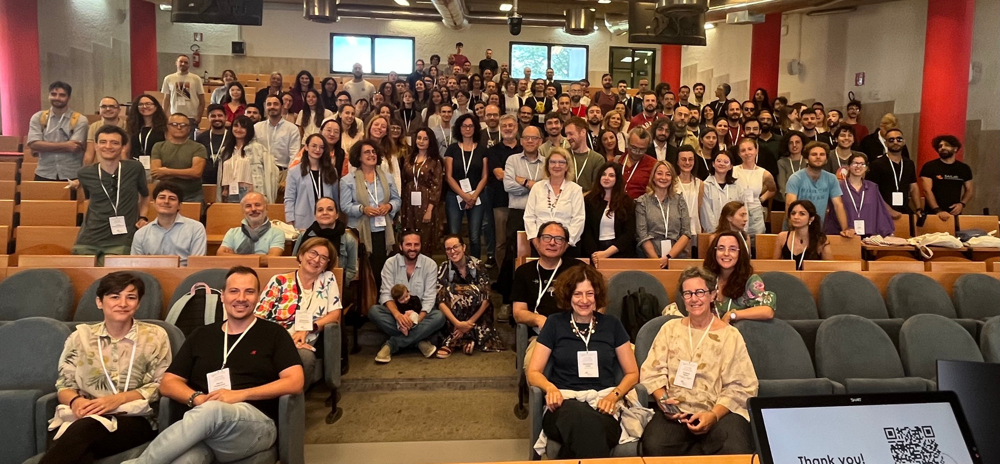

This week I had a lot of fun in Cagliari at CLiC-it 2025, the annual meeting of the Italian Association of Computational Linguistics!

I presented a paper titled “Veras Audire Et Reddere Voces: A Corpus of Prosodically-Correct Latin Poetic Audio from Large-Language-Model TTS”. Check out the pre-proceedings here: https://clic2025.unica.it/pre-proceedings/

It was energizing to connect with the community, meeting new collaborators, and enjoy a beautiful setting by the sea. Kudos to the organizers and reviewers for a great edition of CLiC-it (Cagliari, Italy — September 24–26, 2025).

## Photos

<!-- Place these images in this page's folder -->

